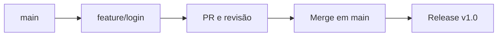

# Guia Completo de Versionamento com Git e GitHub

Este documento é um guia detalhado sobre como trabalhar com versionamento de código usando Git e GitHub, abordando desde a configuração inicial até fluxos de trabalho colaborativos, boas práticas, resolução de conflitos e integração com GitHub.

## 1. Introdução

Git é um sistema de controle de versão distribuído que permite rastrear mudanças em arquivos, organizar o histórico de desenvolvimento e trabalhar colaborativamente.
GitHub é uma plataforma que hospeda repositórios Git na nuvem, possibilitando colaboração, revisão de código, integração contínua e deploy.

Benefícios do versionamento:

* Histórico completo de alterações.
* Facilita trabalho em equipe sem conflitos.
* Permite reverter alterações com segurança.
* Suporte a integração contínua (CI/CD) e deploy automatizado.

## 2. Configuração Inicial

1. Instalar Git: [https://git-scm.com/downloads](https://git-scm.com/downloads)
2. Configurar usuário:

```
git config --global user.name "Seu Nome"
git config --global user.email "seuemail@exemplo.com"
```

3. Verificar configuração:

```
git config --list
```

4. Gerar chave SSH para GitHub:

```
ssh-keygen -t ed25519 -C "seuemail@exemplo.com"
```

Adicionar chave pública em GitHub > Settings > SSH and GPG keys

## 3. Criando um Repositório

### a) Inicializar repositório local

```
git init
```

### b) Adicionar arquivos

```
git add arquivo.txt
# ou
 git add .
```

### c) Criar commit

```
git commit -m "Mensagem explicativa do commit"
```

### d) Conectar ao GitHub

```
git remote add origin git@github.com:usuario/repositorio.git
```

### e) Enviar alterações

```
git push -u origin main
```

## 4. Fluxo de Trabalho em Equipe

1. Criar branches:

```
git checkout -b feature/nome-da-funcionalidade
```

2. Fazer commits:

```
git add .
git commit -m "Implementa funcionalidade X"
```

3. Sincronizar branch com remoto:

```
git push origin feature/nome-da-funcionalidade
```

4. Abrir Pull Request (PR) no GitHub
5. Merge no main e atualizar repositório local:

```
git checkout main
git pull origin main
```

## 5. Comandos Essenciais

| Comando                   | Descrição                                |
| ------------------------- | ---------------------------------------- |
| git status                | Verifica status do repositório           |
| git log                   | Mostra histórico de commits              |
| git diff                  | Mostra diferenças entre versões          |
| git branch                | Lista branches locais                    |
| git branch -r             | Lista branches remotas                   |
| git checkout nome-branch  | Troca de branch                          |
| git merge nome-branch     | Faz merge de branch                      |
| git fetch                 | Baixa atualizações do remoto sem aplicar |
| git pull                  | Baixa e aplica atualizações do remoto    |
| git clone URL             | Clona repositório remoto                 |
| git tag -a v1.0 -m "v1.0" | Cria uma tag de versão                   |

## 6. Boas Práticas

* Commits pequenos e frequentes
* Branches por funcionalidade/correção
* Mensagens claras
* Revisão de código via Pull Request
* Sincronizar branch antes do merge
* Tags para releases

## 7. Lidando com Conflitos

1. Git identifica arquivos em conflito
2. Resolver manualmente
3. Finalizar commit:

```
git add .
git commit -m "Resolve conflitos"
```

## 8. Integração com GitHub

* Issues: registrar bugs ou tarefas
* Projects: Kanban para organização
* Actions: automação de testes, build e deploy
* Wiki: documentação colaborativa

## 9. Exemplo de Diagrama de Versionamento



## 10. Passo a Passo Prático Completo

1. Clonar repositório remoto:

```
git clone git@github.com:usuario/repositorio.git
cd repositorio
```

2. Criar branch:

```
git checkout -b feature/minha-funcionalidade
```

3. Fazer alterações e commits:

```
git add .
git commit -m "Implementa minha funcionalidade"
```

4. Sincronizar branch:

```
git push origin feature/minha-funcionalidade
```

5. Abrir Pull Request
6. Atualizar branch main:

```
git checkout main
git pull origin main
```

7. Merge da branch aprovada:

```
git merge feature/minha-funcionalidade
```

8. Enviar main atualizada:

```
git push origin main
```

9. Criar tag de release (opcional):

```
git tag -a v1.0 -m "Release v1.0"
git push origin v1.0
```

## Referências

* [Git Official Documentation](https://git-scm.com/doc)
* [GitHub Docs](https://docs.github.com/)
* [Atlassian Git Workflow](https://www.atlassian.com/git/tutorials/comparing-workflows)

> Dica: Sempre trabalhe em branches separadas e faça commits claros. Use Pull Requests para revisão antes de mesclar no main.
